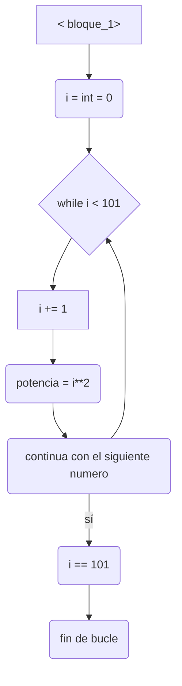
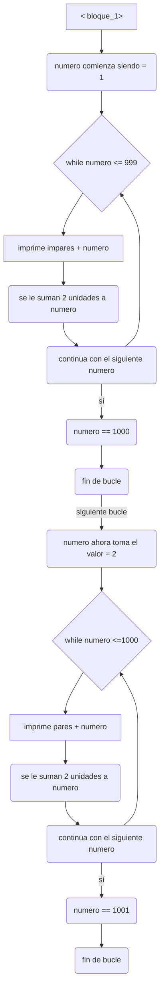
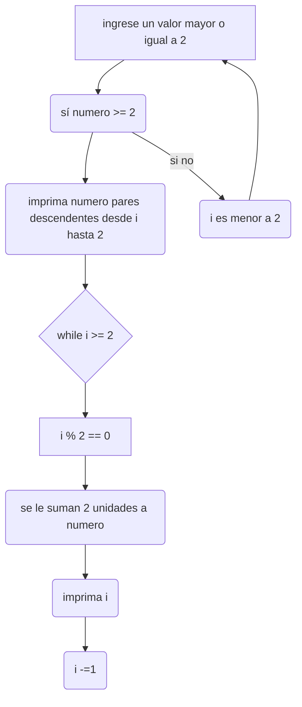

# RETO_6
## EN ESTE REPOSITORIO VEREMOS VARIOS EJEMPLOS DE COMO UTILIZAR LOS BUCLES WHILE
### Imprimir un listado con los números del 1 al 100 cada uno con su respectivo cuadrado.
Para la solucion de dicho problema se plantea el siguiente diagrama: 

Adicional a esto tendriamos como codigo: 
```pseudocode 
i = int = 0

while (i < 101):
  i += 1
  potencia = i ** 2
  if i == 101:
    break
  print(i, potencia)
```
### Imprimir un listado con los números impares desde 1 hasta 999 y seguidamente otro listado con los números pares desde 2 hasta 1000.
para la solucion de este problema se plantea lo siguiente

adiconal a esto tendriamos como codigo lo siguiente:
```pseudocode 
numero = 1
while numero <= 999:
    print("números impares: " + str(numero))
    numero += 2

numero = 2
while numero <= 1000:
    print("números pares: " + str(numero))
    numero += 2
 ```
### Imprimir los números pares en forma descendente hasta 2 que son menores o iguales a un número natural n ≥ 2 dado
Para la solucion de este ejercicio se plantea:

el codigo a utilizar seria el siguiente:
```pseudocode 
n = int(input("Ingrese un número natural n mayor o igual que 2: "))
if n >= 2:
    print(f"Números pares descendentes desde {n} hasta 2:")
    while n >= 2:
        if n % 2 == 0:
            print(n, end=", ")
        n -= 1
else:
    print("El número ingresado no es válido.")
```
